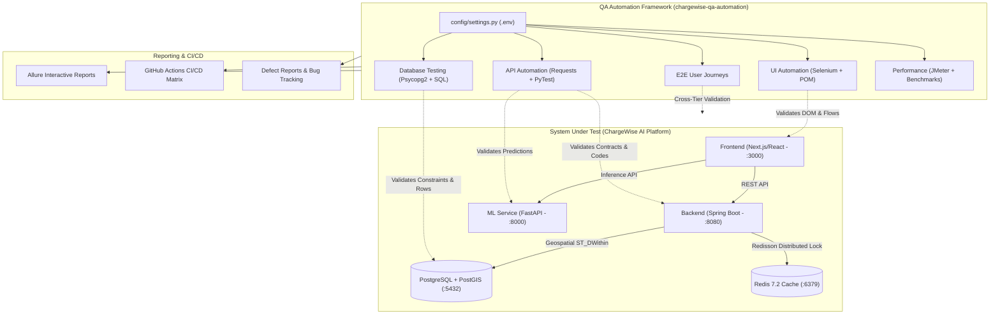

# ⚡ ChargeWise AI - QA Automation & Quality Engineering Framework

[](https://github.com/vishva-ux/ChargeWise-QA/actions/workflows/qa-tests.yml)
[](https://www.python.org/)
[](https://pytest.org/)
[](https://www.selenium.dev/)
[](https://allurereport.org/)
[](LICENSE)

> **An independent, production-grade Quality Engineering & SDET Automation Repository** engineered specifically to test the **ChargeWise AI** Electric Vehicle (EV) Smart Charging and Distributed Locking ecosystem.

---

## 📌 1. Project Overview & Architecture

This repository is completely decoupled from the production application code and acts as an autonomous QA testing engine. It tests the **System Under Test (SUT)** across all technical layers: Frontend UI, REST API Microservices, Machine Learning Inference Engines, PostgreSQL/PostGIS Spatial Database, and Redisson Distributed Locking.

### System Under Test (SUT) vs QA Automation Architecture



---

## 🛠️ 2. Technology Stack

| Layer | Technology | Purpose |
| :--- | :--- | :--- |
| **Language & Runtime** | Python 3.10+ | Core scripting and test architecture |
| **Test Runner & Harness** | PyTest 8.x | Test lifecycle, fixtures, parameterization, and markers |
| **UI Automation** | Selenium WebDriver 4.x | Page Object Model (POM) browser automation |
| **API Automation** | Requests 2.x + Pydantic | REST HTTP contract and schema validation |
| **Database Testing** | Psycopg2 + PostgreSQL | Direct SQL constraint, trigger, and state assertion |
| **Reporting Engine** | Allure Framework 2.x | Rich HTML test reports with screenshots and request logs |
| **Performance Testing** | Apache JMeter 5.6 + Concurrency Runner | Throughput, latency percentiles (p95), and lock contention |
| **Continuous Integration** | GitHub Actions | Automated multi-tier matrix testing on push/PR |

---

## 📁 3. Repository Structure

```text
chargewise-qa-automation/
├── .github/
│   └── workflows/
│       └── qa-tests.yml            # Multi-tier CI/CD workflow matrix
├── api/
│   ├── clients/                    # Reusable HTTP API client wrappers
│   │   ├── base_client.py          # Session management & Allure logging
│   │   ├── auth_client.py          # User authentication endpoints
│   │   ├── station_client.py       # Geospatial station discovery
│   │   ├── booking_client.py       # Atomic slot booking & lock endpoints
│   │   └── ml_prediction_client.py # FastAPI wait-time & stop recommendation
│   ├── tests/                      # API automated test suites
│   │   ├── test_auth_api.py
│   │   ├── test_station_api.py
│   │   ├── test_booking_api.py
│   │   └── test_ml_service_api.py
│   └── conftest.py                 # API test fixtures
├── config/
│   ├── __init__.py
│   └── settings.py                 # Environment settings & .env parser
├── database/
│   ├── db_client.py                # PostgreSQL connection pool & query executor
│   ├── conftest.py                 # DB connection fixtures
│   └── tests/                      # Database test suites
│       ├── test_booking_database.py
│       └── test_station_database.py
├── docs/
│   ├── chargewise-system-analysis.md # Comprehensive SUT technical breakdown
│   ├── test-plan.md                # Master Quality Engineering Test Plan
│   ├── test-cases.md               # 50+ Detailed Test Case specifications
│   ├── test-cases.csv              # Spreadsheet compatible test case export
│   ├── performance-test-report.md  # Concurrency benchmark & latency results
│   └── bug-reports.md              # Discovered defects & RCA documentation
├── e2e/
│   ├── conftest.py
│   └── tests/                      # Cross-service end-to-end user journeys
│       ├── test_e2e_booking_lifecycle.py
│       ├── test_e2e_route_and_reserve.py
│       └── test_e2e_booking_cancellation.py
├── performance/
│   ├── chargewise_load_test.jmx    # Apache JMeter load test plan
│   └── run_performance_benchmark.py# Standalone Python concurrency benchmark
├── reports/
│   ├── allure-results/             # Allure raw JSON/XML execution artifacts
│   └── screenshots/                # Automatic failure screenshots
├── ui/
│   ├── pages/                      # Page Object Model (POM) classes
│   │   ├── base_page.py            # Explicit waits, locator wrappers
│   │   ├── login_page.py           # Modal & /auth page interactions
│   │   ├── home_page.py            # Header, profile, AI search module
│   │   ├── station_page.py         # BottomSheet listing & card filters
│   │   ├── booking_page.py         # Reservation drawer & QR pass view
│   │   └── route_page.py           # Route planner & battery optimizer
│   ├── tests/                      # Selenium UI automated test suites
│   │   ├── test_login.py
│   │   ├── test_stations.py
│   │   ├── test_booking.py
│   │   └── test_route_planner.py
│   └── conftest.py                 # WebDriver fixture & failure hooks
├── .env.example                    # Environment variable template
├── .gitignore
├── conftest.py                     # Root fixture & Allure environment setup
├── pytest.ini                      # PyTest CLI options and markers
├── requirements.txt                # Python dependencies
└── README.md                       # Master Documentation
```

---

## 🚀 4. Step-by-Step Guide: How to Run the Projects

### 🅰️ Part 1: Starting the ChargeWise Application (System Under Test)

Before running the QA test suites, start the ChargeWise services you wish to test.

#### 1. Start the Frontend Application (Port 3000)
Open a terminal in the root `ChargeWise AI` parent folder:
```bash
cd "ChargeWise AI/frontend"
npm install
npm run dev
```
> The Frontend will be available at: **`http://localhost:3000`**

#### 2. Start the Machine Learning Microservice (Port 8000)
In a second terminal window:
```bash
cd "ChargeWise AI"
PYTHONPATH="." ml_service/venv/bin/python -m uvicorn ml_service.api.main:app --host 0.0.0.0 --port 8000
```
> Verify health check: Open **`http://localhost:8000/health`** in browser (returns `{"status":"healthy"}`).

#### 3. Start Core Backend & Database (Docker Compose - Optional)
If Docker is running on your machine:
```bash
cd "ChargeWise AI"
docker-compose up -d postgres redis backend
```

---

### 🅱️ Part 2: Setting Up & Running the QA Automation Project

Open a new terminal window inside the QA project directory:
```bash
cd "ChargeWise AI/ChargeWise-QA"
```

#### Step 1: Create Virtual Environment & Install QA Dependencies
```bash
# Create virtual environment
python3 -m venv venv

# Activate virtual environment
# On macOS / Linux:
source venv/bin/activate
# On Windows:
# venv\Scripts\activate

# Install testing dependencies
pip install -r requirements.txt
```

#### Step 2: Configure Environment Variables
Copy the example environment file:
```bash
cp .env.example .env
```
*(Default values are already pre-configured for `http://localhost:3000`, `http://localhost:8000`, and `http://localhost:8080`)*

---

### 🧪 Part 3: Running Automated Test Suites

Ensure your virtual environment is active (`source venv/bin/activate`).

#### 1. Run UI Automation Tests (Selenium WebDriver POM)
Executes Chrome browser automation against the live Next.js app:
```bash
# Run all UI tests
pytest ui/tests -v

# Run specific UI modules
pytest ui/tests/test_stations.py -v   # Tests station listing & AI filter
pytest ui/tests/test_booking.py -v    # Tests slot reservation & QR pass
pytest ui/tests/test_login.py -v      # Tests driver login modal
```
> **Tip:** To see the real Chrome browser window open visually during testing, set `SELENIUM_HEADLESS=false` in `.env`.

#### 2. Run REST API & ML Model Tests
Executes HTTP contract and validation tests against the FastAPI & Spring Boot microservices:
```bash
# Run ML microservice tests (:8000)
pytest api/tests/test_ml_service_api.py -v

# Run All API tests
pytest api/tests -v
```

#### 3. Run Database Integrity Tests (PostgreSQL)
```bash
pytest database/tests -v
```

#### 4. Run End-to-End (E2E) Integration Journeys
```bash
pytest e2e/tests -v
```

#### 5. Run by Tag / Marker
```bash
# Run quick sanity smoke suite
pytest -v -m "smoke"

# Run full regression suite
pytest -v -m "regression"
```

---

### ⚡ Part 4: Running Performance & Concurrency Load Tests

#### Option A: Standalone Python Benchmark (Instant Console Table)
Simulates concurrent load (10, 50, and 100 virtual users) measuring TPS, average latency, and p95 latency percentiles:
```bash
python performance/run_performance_benchmark.py
```

#### Option B: Apache JMeter CLI / GUI
```bash
# Run JMeter load test in non-GUI mode
jmeter -n -t performance/chargewise_load_test.jmx -l performance/results.jtl -e -o performance/html_report
```

---

### 📊 Part 5: Viewing Allure Interactive HTML Reports

Execution results are automatically recorded in `reports/allure-results/`.

```bash
# 1. Install Allure CLI (if not already installed)
# macOS (Homebrew): brew install allure
# Windows (Scoop):  scoop install allure
# NPM:              npm install -g allure-commandline

# 2. View live interactive dashboard in browser
allure serve reports/allure-results

# 3. (Alternative) Generate standalone static HTML folder
allure generate reports/allure-results -o reports/allure-report --clean
allure open reports/allure-report
```

---

## 🎓 5. College Viva & SDET Interview Defense Notes

### Q1: Why is QA placed in a completely separate repository?
> **Answer:** In professional SDET workflows, decoupling QA prevents circular dependency hell, allows independent CI/CD test schedules, enables testing across multiple environments (Dev, Staging, Production) without touching application build pipelines, and enforces strict black-box/gray-box testing principles.

### Q2: How does the framework handle flakiness in UI Automation?
> **Answer:** We eliminate arbitrary `time.sleep()` calls and use Selenium's `WebDriverWait` with Expected Conditions (`EC.visibility_of_element_located`, `EC.element_to_be_clickable`). The BasePage also catches `StaleElementReferenceException` with automatic retries, and failed tests automatically capture DOM screenshots attached to Allure.

### Q3: How do you verify distributed locking without double-booking?
> **Answer:** In `api/tests/test_booking_api.py` and `performance/chargewise_load_test.jmx`, we dispatch concurrent threads against `/api/v1/bookings/reserve`. We assert that the Redisson lock enforces atomic isolation so that overlapping requests are serialized or safely rejected with informative messages rather than corrupting database inventory.

### Q4: How do you test PostGIS geospatial queries in PostgreSQL?
> **Answer:** In `database/tests/test_station_database.py`, we query PostgreSQL metadata directly to verify that the `location` column is defined as `ST_Point` with SRID 4326 (`WGS 84`) and that spatial indexes (`GIST`) exist to accelerate `ST_DWithin` corridor calculations.

---

## 📄 License & Attribution

Distributed under the **MIT License**. Created for the **ChargeWise AI** Quality Engineering Portfolio.
