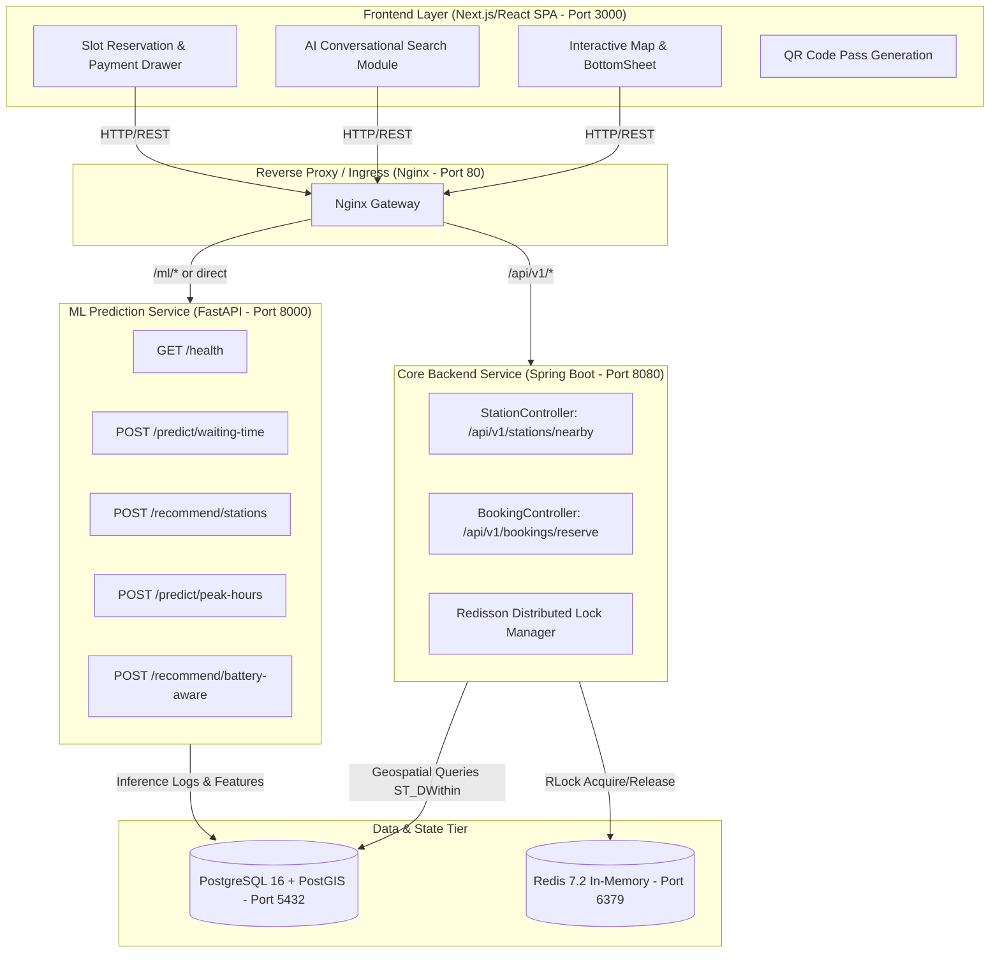

# ChargeWise AI - Comprehensive System & Architecture Analysis

> **Document Type:** System Under Test (SUT) Technical Breakdown  
> **Prepared For:** ChargeWise QA Automation Engineering Suite  
> **Version:** 1.0.0  
> **Target Date:** September 2026  

---

## 1. Executive Overview

**ChargeWise AI** is an intelligent Electric Vehicle (EV) charging ecosystem engineered to eliminate range anxiety, optimize station occupancy, and guarantee atomic slot reservation without double-booking race conditions.

The platform combines:
1. **Interactive Frontend SPA (Next.js / React)** delivering a mobile-first 440px viewport canvas experience with real-time map clustering, natural language AI search, slot reservation modals, and QR pass generation.
2. **Core Backend (Java Spring Boot 3.x)** managing geospatial station corridor queries (PostGIS), user profiles, and atomic reservations protected by **Redisson Distributed Locks**.
3. **Machine Learning Service (Python FastAPI + XGBoost/Scikit-learn)** computing predictive queue waiting times, battery-aware stop recommendations, and peak-hour demand forecasts.
4. **Data Tier (PostgreSQL 16 + PostGIS + Redis 7.2)** providing spatial indexing (`GIST`), relational schema enforcement, and distributed locking.



---

## 2. Component Inventory & Port Allocation

| Component | Technology | Default Local Port | Docker Internal Port | Container Name | Health Endpoint |
| :--- | :--- | :--- | :--- | :--- | :--- |
| **Frontend UI** | Next.js 14, React 18, Tailwind CSS | `3000` | `80` | `chargewise_frontend` | `/` (200 OK) |
| **Core Backend** | Java 17+, Spring Boot 3.x | `8080` / `5000` | `80` / `8080` | `chargewise_backend` | `/actuator/health` or `/api/v1/stations/nearby` |
| **ML Engine** | Python 3.11+, FastAPI, Uvicorn | `8000` | `8000` | `chargewise_ml_service` | `/health` |
| **Database** | PostgreSQL 16 with PostGIS 3.4 | `5432` | `5432` | `chargewise_postgres` | `pg_isready -h localhost -p 5432` |
| **Cache & Lock** | Redis 7.2 Alpine | `6379` | `6379` | `chargewise_redis` | `redis-cli ping` |
| **Nginx Proxy** | Nginx 1.25 Alpine | `80` | `80` | `chargewise_nginx` | `/` |

---

## 3. Detailed REST API Surface Analysis

### 3.1 Core Spring Boot Backend APIs (`/api/v1`)

#### 1. Nearby Station Discovery
- **Endpoint:** `GET /api/v1/stations/nearby`
- **Query Parameters:**
  - `lat` (double, default: `13.0418`): Latitude of search center
  - `lng` (double, default: `80.2341`): Longitude of search center
  - `radiusKm` (double, default: `50.0`): Radius in kilometers
- **Success Response (200 OK):**
  ```json
  [
    {
      "id": "st-001",
      "name": "Relux Fast Charge - T. Nagar Node",
      "address": "Near Zenith Towers, Anna Salai, Chennai",
      "latitude": 13.0418,
      "longitude": 80.2341,
      "availablePorts": 4,
      "totalPorts": 6,
      "powerKw": 120,
      "connectorType": "CCS2 Fast",
      "pricePerKwh": 18.5,
      "predictedWaitTimeMins": 4,
      "distanceKm": 1.2
    }
  ]
  ```

#### 2. Atomic Slot Reservation
- **Endpoint:** `POST /api/v1/bookings/reserve`
- **Request Headers:** `Content-Type: application/json`
- **Request Body:**
  ```json
  {
    "stationId": "st-001",
    "userPhone": "+91 98765 43210",
    "vehicleType": "EV Fleet Cab",
    "paymentMethod": "UPI"
  }
  ```
- **Success Response (200 OK):**
  ```json
  {
    "success": true,
    "passId": "CW-PASS-8392",
    "stationId": "st-001",
    "message": "Atomic slot reservation confirmed via Redisson distributed lock.",
    "timestamp": 1726000000000
  }
  ```
- **Error Response (409 Conflict / 200 OK with success=false):**
  ```json
  {
    "success": false,
    "passId": null,
    "stationId": "st-001",
    "message": "Lock acquisition timeout. Slot reserved by another driver.",
    "timestamp": 1726000000000
  }
  ```

---

### 3.2 Machine Learning Microservice APIs (`http://localhost:8000`)

#### 1. Service Health Check
- **Endpoint:** `GET /health`
- **Response:** `{"status": "healthy", "service": "ChargeWise-ML-Engine", "models_loaded": true}`

#### 2. Waiting Time Prediction
- **Endpoint:** `POST /predict/waiting-time`
- **Request Body:**
  ```json
  {
    "day_of_week": 2,
    "hour_of_day": 14,
    "total_chargers": 6,
    "current_occupancy": 4
  }
  ```
- **Response (200 OK):**
  ```json
  {
    "predicted_wait_minutes": 12.4,
    "confidence_score": 0.94,
    "congestion_level": "Moderate"
  }
  ```

#### 3. Battery-Aware Route Stop Optimization
- **Endpoint:** `POST /recommend/battery-aware`
- **Request Body:**
  ```json
  {
    "current_soc": 25.0,
    "battery_capacity_kwh": 60.0,
    "destination_distance_km": 180.0
  }
  ```

#### 4. Peak Hour Demand Forecast
- **Endpoint:** `POST /predict/peak-hours`
- **Request Body:**
  ```json
  {
    "hour": 18,
    "day": 4
  }
  ```

---

## 4. PostgreSQL Database Schema Analysis

The relational schema resides in PostgreSQL with PostGIS extensions:

### 1. `users` Table
Stores registered EV drivers and fleet operators.
- `id` (UUID, Primary Key)
- `full_name` (VARCHAR 100)
- `email` (VARCHAR 150, UNIQUE)
- `password_hash` (VARCHAR 255)
- `role` (VARCHAR 20: 'User' / 'Admin')
- `vehicle_model` (VARCHAR 100)
- `battery_capacity_kwh` (INT)
- `preferred_connector` (VARCHAR 30: 'CCS2', 'Type2', etc.)
- `created_at` (TIMESTAMP WITH TIME ZONE)

### 2. `stations` Table
Stores EV charging physical locations with spatial coordinates.
- `id` (UUID, Primary Key)
- `name` (VARCHAR 150)
- `address` (TEXT)
- `location` (`GEOMETRY(Point, 4326)` with GIST Index `idx_stations_location`)
- `rating` (NUMERIC 3,2)
- `total_chargers` (INT)
- `available_chargers` (INT)
- `price_per_kwh` (NUMERIC 5,2)
- `operator_name` (VARCHAR 100)
- `is_active` (BOOLEAN)

### 3. `chargers` Table
Individual dispensing units at a station.
- `id` (UUID, Primary Key)
- `station_id` (UUID, Foreign Key -> `stations.id` ON DELETE CASCADE)
- `serial_number` (VARCHAR 50, UNIQUE)
- `type` (VARCHAR 30: 'CCS2', 'Type2', 'CHAdeMO', 'Supercharger')
- `max_power_kw` (NUMERIC 5,2)
- `status` (VARCHAR 30: 'Available', 'Occupied', 'Maintenance')
- `price_rate` (NUMERIC 5,2)

### 4. `bookings` Table
Reservation records and QR token passes.
- `id` (UUID, Primary Key)
- `user_id` (UUID, Foreign Key -> `users.id`)
- `charger_id` (UUID, Foreign Key -> `chargers.id`)
- `station_id` (UUID, Foreign Key -> `stations.id`)
- `start_time` (TIMESTAMPTZ)
- `end_time` (TIMESTAMPTZ)
- `estimated_cost` (NUMERIC 8,2)
- `status` (VARCHAR 30: 'Pending', 'Confirmed', 'Cancelled', 'Completed')
- `qr_code_token` (VARCHAR 255, UNIQUE)
- `created_at` (TIMESTAMPTZ)

### 5. `payments` Table
Transactional payment ledger records.
- `id` (UUID, Primary Key)
- `booking_id` (UUID, Foreign Key -> `bookings.id`)
- `amount` (NUMERIC 8,2)
- `payment_method` (VARCHAR 50: 'UPI', 'CreditCard', 'FleetWallet')
- `status` (VARCHAR 30: 'Success', 'Failed', 'Refunded')
- `transaction_reference` (VARCHAR 100, UNIQUE)

---

## 5. UI Architecture & Stable Locator Strategy

The frontend interface utilizes modern Tailwind styling. Recommended selectors and fallback strategies are documented below:

| UI Component | Purpose | Target Element | Current Accessible Selector | Recommended `data-testid` |
| :--- | :--- | :--- | :--- | :--- |
| **Login Modal** | Phone & Vehicle selection | Phone input | `input[placeholder*="Phone"]`, `input[type="tel"]` | `data-testid="login-phone-input"` |
| **Login Modal** | Submit login | Continue button | `button:has-text("Continue"), button.bg-slate-950` | `data-testid="login-submit-btn"` |
| **Search Module** | AI query box | Prompt textarea/input | `input[placeholder*="Ask ChargeWise AI"]` | `data-testid="ai-search-input"` |
| **Search Module** | Search trigger | Action button | `button:has(svg)` in search container | `data-testid="ai-search-btn"` |
| **Station Card** | Discovery list item | Station title card | `div:has-text("Relux Fast Charge"), div.p-4.rounded-2xl` | `data-testid="station-card-item"` |
| **Station Card** | Reserve action | Reserve button | `button:has-text("RESERVE SLOT")` | `data-testid="btn-reserve-slot"` |
| **Booking Drawer** | Payment method | UPI / Wallet radio | `input[type="radio"][name="payment"]` | `data-testid="payment-method-radio"` |
| **Booking Drawer** | Confirm reservation | Proceed button | `button:has-text("PROCEED TO SECURE RESERVATION")` | `data-testid="btn-proceed-reserve"` |
| **QR Pass View** | Confirmed Pass Code | Pass Identifier | `span.font-mono.font-bold` | `data-testid="qr-pass-token"` |
| **Profile Drawer** | User Details & Logout | Sign Out button | `button:has-text("Sign Out"), button:has-text("Logout")` | `data-testid="btn-logout"` |

---

## 6. QA Automation Architecture Strategy

To guarantee maximum reliability and maintainability:
1. **Separation of Concerns:** Keep QA code 100% decoupled from product code.
2. **Layered Automation:**
   - **API Tier (Fastest):** Direct HTTP validation of Spring Boot & FastAPI endpoints.
   - **Database Tier:** SQL query verification of constraints, triggers, and state transitions.
   - **UI Tier (POM):** User journey simulation in headless and windowed Chrome.
   - **E2E Tier:** Multi-service integration flow validation.
   - **Performance Tier:** JMeter thread groups for latency SLA validation under load.
