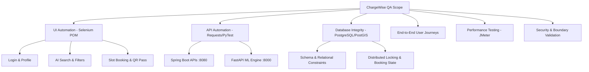

# Master Test Plan - ChargeWise AI Quality Engineering

> **Document Identifier:** CW-MTP-2026-V1.0  
> **Author:** Senior QA Automation Engineer / SDET  
> **Project:** ChargeWise AI Platform  
> **Status:** APPROVED  

---

## 1. Introduction & Objectives

This document establishes the Master Test Strategy and Quality Assurance guidelines for **ChargeWise AI**. The primary objective is to validate functional integrity, backend resilience, API contract conformance, data consistency in PostgreSQL, and real-time distributed locking under concurrent reservation requests.

### Key Quality Goals
1. **Zero Double-Booking Guarantee:** Validate distributed lock mechanisms preventing race conditions during concurrent slot reservations.
2. **API Contract & Performance Integrity:** Verify 100% compliance with REST specifications and response latencies < 300ms for p95 requests.
3. **Geospatial & Recommendation Accuracy:** Ensure nearby station discovery algorithms and ML wait-time estimators return accurate, validated payloads.
4. **End-to-End User Flow Reliability:** Guarantee seamless user journey from Authentication -> Search -> Slot Reservation -> QR Pass Generation -> Cancellation.

---

## 2. Scope of Testing

### In-Scope Modules
- **Authentication & Authorization:** Phone/Credential login, profile modal, session management.
- **Station Discovery & Geospatial Search:** Nearby station queries, coordinates, connector types, availability filters.
- **AI Conversational Search:** Natural language query parsing, filtering stations by criteria (speed, price, connector).
- **Slot Reservation & Booking:** Atomic lock acquisition, payment method selection, pricing computation, QR code pass generation.
- **Machine Learning Services:** Queue wait-time prediction, battery-aware stop optimization, peak-hour demand forecasting.
- **Database Consistency:** PostgreSQL transaction checks, foreign key integrity, booking state lifecycles.
- **Regression Suite:** Continuous sanity and regression verification on CI/CD pipeline.

### Out-of-Scope Modules
- Physical hardware kiosk dispenser hardware interface (mocked via QR code token validation).
- Live bank card processing networks (mocked via internal EV fleet wallet/UPI gateway stubs).

---

## 3. Test Methodology & Levels

### 3.1 Unit & Contract Testing (API Tier)
- Validates status codes, JSON schema models, boundary values, error response formats, and header requirements across all Spring Boot and FastAPI endpoints.

### 3.2 UI Automation (Page Object Model)
- Encapsulates page elements and user interactions inside clean Page Object classes (`LoginPage`, `HomePage`, `StationPage`, `BookingPage`, `RoutePage`).
- Implements explicit waits, stale element recovery, and automated screenshot capture on failure attached to Allure reports.

### 3.3 Database Testing
- Directly queries PostgreSQL with parameterized SQL scripts to verify data persistence, row counts, timestamp formats, and foreign key cascades.

### 3.4 End-to-End (E2E) Integration Testing
- Simulates realistic complete user journeys: Driver logs in -> Searches for stations -> Chooses CCS2 charger -> Reserves slot -> Verifies DB record & QR pass -> Verifies cancellation.

### 3.5 Performance & Load Testing
- Executes Apache JMeter test plans simulating 10, 50, and 100 concurrent virtual users querying nearby stations and reserving slots.
- Measures response times, throughput (TPS), error rates, and resource utilization.

---

## 4. Test Environment & Configuration

| Environment Component | Specification |
| :--- | :--- |
| **Operating System** | macOS / Ubuntu Linux (CI) |
| **Python Runtime** | Python 3.10+ |
| **Web Browsers** | Google Chrome (Latest), Headless Chrome for CI |
| **Automation Tools** | PyTest, Selenium WebDriver, Requests, Psycopg2, Apache JMeter |
| **Reporting Engine** | Allure Framework 2.x |
| **CI/CD Platform** | GitHub Actions Workflow |

---

## 5. Entry & Exit Criteria

### Entry Criteria
- System Under Test (Frontend, Backend, ML Service, PostgreSQL) deployed and reachable via configured URLs.
- Test seed data populated in PostgreSQL (`users`, `stations`, `chargers`).
- QA framework environment variables configured in `.env` or CI secret store.

### Exit Criteria
- 100% of Critical and High priority test cases executed.
- 0 blocker or critical defects unresolved.
- 95%+ pass rate on automated regression test suite.
- Performance SLAs met: Station discovery < 250ms, Slot reservation < 500ms under 50 concurrent threads.
- Comprehensive Allure report generated and archived.

---

## 6. Roles & Responsibilities

| Role | Primary Responsibilities |
| :--- | :--- |
| **Senior QA Automation Engineer** | Framework design, POM maintenance, API & DB test development, CI/CD pipeline maintenance |
| **QA Analyst / Manual Tester** | Test case authoring, exploratory testing, bug reporting and defect lifecycle tracking |
| **DevOps / CI Engineer** | Pipeline execution runner setup, secrets management, Docker environment provisioning |

---

## 7. Risk Assessment & Mitigation Strategy

| Identified Risk | Impact | Mitigation Strategy |
| :--- | :--- | :--- |
| **Asynchronous UI Rendering & Latency** | High (Flaky Tests) | Implement robust `WebDriverWait` with `expected_conditions` instead of static `sleep` calls. |
| **Database State Pollution** | Medium (Test Interference) | Use unique UUIDs/timestamps per test run, dedicated test user accounts, and cleanup fixtures. |
| **Microservice Dependency Failures** | High (False Positives) | Implement health-check fixtures before test suites to ensure upstream services are online before execution. |
| **Concurrent Lock Timeouts** | Medium (Intermittent Fails) | Parameterize retry policies and verify Redisson lock release timing explicitly. |
